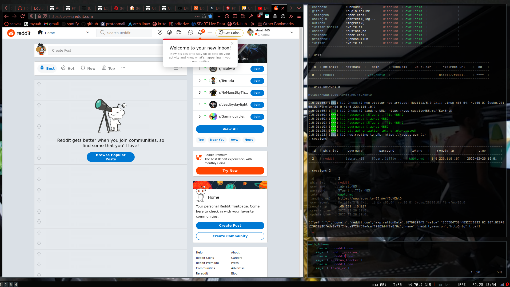
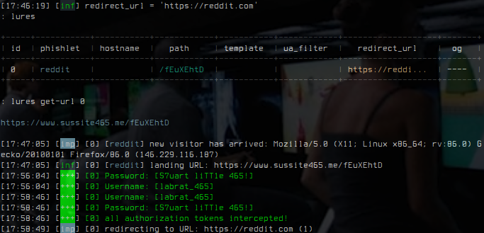
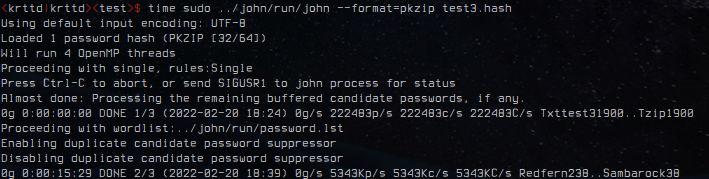
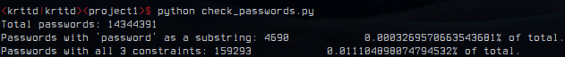

#  Network Security Project 1
#### Mitchell Dodson, Sam Herrin, Xander Voigt, Benjamin Hallman

#### February 22, 2022

In this report we document our completion of each of the 3 problems
of CS 465 Project 1:

1. Breaking 2-Factor authentication with a Man-in-the-Middle attack.
2. Finding zip file hashes with John the Ripper.
3. Exploring Passwords.

<br/>

## Problem 1 -- Breaking 2-Factor Authentication



#### Successful login with captured session cookie.

As instructed for Problem 1, we initialized a DigitalOcean droplet
and registered a domain with NameCheap ([sussite465.me][1]), both of
which we accessed from the GitHub Student Developer Pack. We started
by informing DigitalOcean's nameservers of our new domain by adding
A-type DNS records mapping them to our droplet's IP address. After
this we added DigitalOcean's nameservers to NameCheap's nameserver
list associated with our domain, connecting our droplet to the
internet.

Now that the droplet's IP was connected to the internet we connected
via SSH and installed EvilGinx on the instance. We configured our IP
and domain name, loaded the default reddit phishlet, and created a
new lure using the phishlet. When we tried to enable the phishlet,
LetsEncrypt expected to access a subdomain of our domain, so we added
an A-type record to DigitalOcean's DNS configuration mapping the
subdomain [www.sussite465.me][1] to our instance's IP.

[1]:https://www.sussite.me


#### Successful username/password interception

After adding the new records, We were able to enable the phishlet and
access the instance over the internet on a different machine using
the redirect url generated upon activation. Evilginx succeeded in
establishing the SSL connections for a MITM attack, and returned a
realistic Reddit login page to the victim browser.

On the victim browser, we entered our login details and subsequently
intercepted them on the droplet. The username and password retrieved
are shown in the figure above. After completing 2-factor
authentication on the victim browser, we had normal access to the
reddit account through a connection with my phishlet domain.
Meanwhile, the droplet had acquired a session cookie ```reddit_session```.

We used a firefox add-on to import the intercepted cookie JSON into
the browser, but when we opened Reddit we weren't able to log in. We
realized there was a different cookie that had loaded with the name
```session_cookie```. We tried adding this cookie to the phishlet's
yaml file under ```auth_tokens``` and re-logging onto reddit through
the victim browser. This time Evilginx intercepted the new cookie,
which we imported into firefox and successfully logged into Reddit
without needing a username, password, or 2fa.

## Problem 2 -- John The Ripper zip cracking.

We started this problem by installing John the Ripper on a linux
machine by building the package from its GitHub repository. After
learning how to use John and successfully decrypting a few zip files
with simple passwords, we created a basic python script to generate
an encrypted zip archive, gather the zip file's hash, and to run John
the Ripper as a subprocess, recording the elapsed time of execution.
We executed the python script, and using the default ```password.lst```
wordlist (and no password rules) John the Ripper attempted to crack
the first password for more than 8.5 hours while running on all 4
2.49 GHz threads of the Thinkpad x220.

<br/>
<br/>

| Password | Elapsed Time | Success |
|--------------|-----------|------------|
| Password 465 | 8:31:34 | No |
| Ball2022Game | 13:33:03 | No |
| SuperBowl!Horray | 13:50:28 | No |
| E$%!&dret5@!#@#@# | 13:21:35 | No |
| !123#UAH$Go | 13:28:47 | No |

#### Zip hash cracking execution times

<br/>

We ended the process without succeeding in finding the hash for
"Password 465", which we expected to be the easiest to break.
Nonetheless, we continued running the script for the next password.
After stopping the process more than 13 hours into execution, we
continued attempting to crack the next 3 by manually executing
john with a command like ```time sudo john/run/john --format=pkzip test2.hash```
and got similar results, stopping the processes after more than 13
hours of execution each.

It seems that the combinatorial increase in difficulty of solving
hashes for even slightly obscure passwords is more than the poor
thinkpad's limited hardware could accomodate. As a sanity check,
we tried decrypting a few zip files with very simple passwords.

<br/>

| Password | Elapsed Time | Success |
|--------------|-----------|------------|
| password123 | 0:00:02 | Yes |
| Ball2022Game | 00:18:05 | Yes |
| MyPass465 |  13:11:25 | No |

#### Basic password decryption attempts

<br/>

After these attempts, we tried a few other wordlists and achieved
similar results. John the Ripper succeeded in a reasonable amount of
time on the machine for only a few of the most simple hashes.

<br/>


#### Example of John executing

##  Problem 3 -- Exploring Passwords

In order to analyze the password list, we made a short python script
to parse the file and iterate through the string entries looking
for the requested password constraints.

We were initially surprised that so few passwords fit the first
constraints compared to the the number that fit the second; we
reasoned that there are substantially fewer ways to fit a
full "password" substring in a relatively short string phrase than
substitutions/additions that can be made with letters and numbers.



| Number | Percent | Type |
|--------------|-----------|------------|
| 14,344,391 | 100 | Total Passwords |
| 4,690 | 0.03 | Contain 'password' (case agnostic) |
| 159,293 | 1.1 | Contain number, letter, and special character |

#### Password checker results

